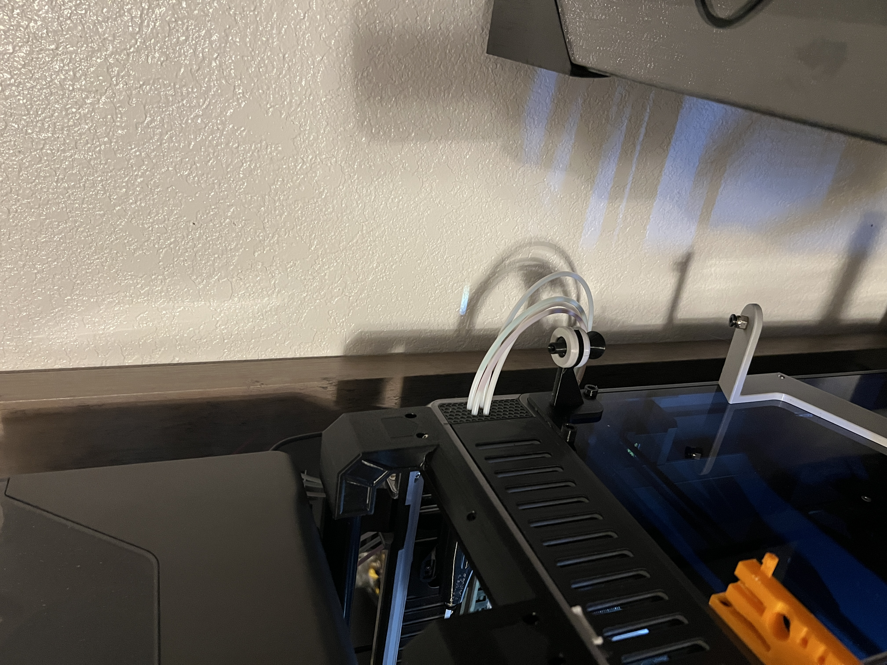
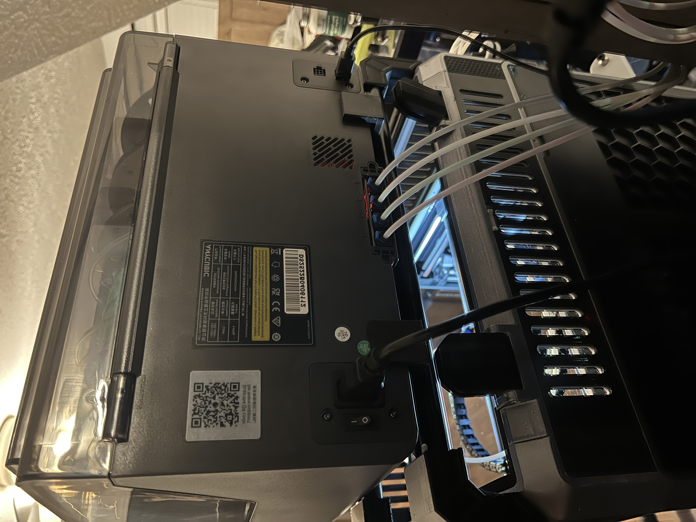
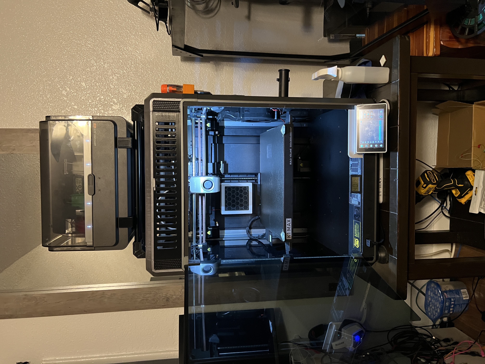

# ACE PRO K1 Max with CFS upgrade Kit - Anycubic Color Engine Pro Driver for K1 Max, K1 series and Klipper

A comprehensive Klipper driver for the Anycubic Color Engine Pro multi-material unit, optimized for K1 Max with CFS upgrade kit and other Klipper-based 3D printers.

## 📋 Table of Contents

- [Credits](#-credits)
- [Features](#-features)
- [Hardware Requirements](#-hardware-requirements)
- [Images](#images)
- [Installation](#-installation)
- [Pin Configuration](#pin-configuration)
- [Commands Reference](#-commands-reference)
- [Endless Spool Feature](#-endless-spool-feature)
- [Inventory Management](#-inventory-management)
- [Hardware Setup](#-hardware-setup)
- [Contributing](#-contributing)

## 📜 Credits

This project is based on excellent work from:

- **[ACEResearch](https://github.com/printers-for-people/ACEResearch.git)** - Original ACE Pro research
- **[DuckACE](https://github.com/utkabobr/DuckACE.git)** - Base driver implementation
- **[BunnyAce](https://github.com/BlackFrogKok/BunnyACE)** - Base driver fork
- **[ACEPROSV08](https://github.com/szkrisz/ACEPROSV08)** - Forked from

## ✅ Features

- **Multi-Material Support**: Full 4-slot filament management
- **Endless Spool**: Automatic filament switching on runout
- **Persistent State**: Settings and inventory saved across restarts
- **Feed Assist**: Advanced filament feeding control
- **Runout Detection**: Dual sensor runout detection system
- **Inventory Tracking**: Material type, color, and temperature management
- **Temperature Monitoring**: Ace chamber temp added to Temperatures panel
- **Debug Tools**: Comprehensive diagnostic commands
- **Seamless Integration**: Native Klipper integration

## 🔧 Hardware Requirements

### Required Components
- **Anycubic Color Engine Pro** multi-material unit
- **Filament Sensors**: 
  - Extruder sensor (at entrance of extruder)
  - Toolhead sensor (before hotend at cutter)
- **Hotend**: Compatible with filament cutting (recommended)

### Recommended Hardware
- **K1 Series CFS upgrade kit**: [K1 Series CFS upgrade Kit](https://a.co/d/8LgaJeT)
- **Filament Splitter**: [BAMBULAB filament splitter](https://www.printables.com/model/1133951-v4-toolhead-ideal-for-mmu-for-sv08-and-any-voron-g)

## Images
<picture>
  <a href="img/IMG_6935.jpeg" target=_new></a>
  <a href="img/IMG_6936.jpeg" target=_new></a>
  <a href="img/IMG_6937.jpeg" target=_new></a>
  <a href="img/IMG_6938.jpeg" target=_new></a>
  <a href="img/IMG_6939.jpeg" target=_new></a>
</picture>

## 📦 Installation

### 1. Clone Repository
```bash
cd ~
git clone https://github.com/swilsonnc/ACEPROK1Max.git
```

### 2. Install
```bash
# Run install.sh
./ACEPROK1Max/install.sh
```

### 3. Update Printer Configuration
Add near the top of your `printer.cfg`:
```ini
[include ace.cfg]
```
Add near the bottom of your `printer.cfg` to add the Ace Chamber temp to your Temperatures panel:
```ini
[temperature_ace]

[temperature_sensor ace_chamber]
sensor_type: temperature_ace
min_temp: 0
max_temp: 70
```
Comment out [filament_switch_sensor filament_sensor] section in printer.cfg
```ini
#[filament_switch_sensor filament_sensor]
#pause_on_runout: false
#switch_pin: !PC15
#runout_gcode:
#  
#    G91
#    G0 E30 F600
#    G90
#  
```
Add in your `printer.cfg`for correct temperatures when purging and cutting:
```ini
[gcode_macro _GLOBAL_VARS]
variable_extruder_target: 0.0
gcode:
```
Add this near the top of your start_print macro under the initial {% set extruder_temp line
```ini
SET_GCODE_VARIABLE MACRO=_GLOBAL_VARS VARIABLE=extruder_target VALUE={params.EXTRUDER_TEMP}
```

### Pin-Configuration


Connect the ACE Pro to a regular USB port and configure the sensor pins according to your board layout.

## 🎯 Commands Reference

### Basic Operations
| Command | Description | Parameters |
|---------|-------------|------------|
| `ACE_CHANGE_TOOL` | Manual tool change | `TOOL=<0-3\|-1>` |
| `ACE_CHANGE_SPOOL` | Change spool (retract filament back to ACEPRO) | `INDEX=<0-3>` |
| `ACE_FEED` | Feed filament | `INDEX=<0-3> LENGTH=<mm> [SPEED=<mm/s>]` |
| `ACE_RETRACT` | Retract filament | `INDEX=<0-3> LENGTH=<mm> [SPEED=<mm/s>]` |
| `ACE_GET_CURRENT_INDEX` | Get current slot | Returns: `-1, 0, 1, 2, 3` |

### Feed Assist
| Command | Description | Parameters |
|---------|-------------|------------|
| `ACE_ENABLE_FEED_ASSIST` | Enable feed assist | `INDEX=<0-3>` |
| `ACE_DISABLE_FEED_ASSIST` | Disable feed assist | `INDEX=<0-3>` |

### Inventory Management
| Command | Description | Parameters |
|---------|-------------|------------|
| `ACE_SET_SLOT` | Set slot info | `INDEX=<0-3> COLOR=<R,G,B> MATERIAL=<name> TEMP=<°C>` |
| `ACE_SET_SLOT` | Set slot empty | `INDEX=<0-3> EMPTY=1` |
| `ACE_QUERY_SLOTS` | Get all slots | Returns JSON |
| `ACE_SAVE_INVENTORY` | Save inventory | Manual save trigger |

### Endless Spool
| Command | Description |
|---------|-------------|
| `ACE_ENABLE_ENDLESS_SPOOL` | Enable endless spool |
| `ACE_DISABLE_ENDLESS_SPOOL` | Disable endless spool |
| `ACE_ENDLESS_SPOOL_STATUS` | Show endless spool status |

### Diagnostics
| Command | Description |
|---------|-------------|
| `ACE_TEST_RUNOUT_SENSOR` | Test sensor states |
| `ACE_DEBUG` | Debug ACE communication |
| `ACE_GET_CURRENT_INDEX` | Get currently loaded slot index |

### Dryer Control
| Command | Description | Parameters |
|---------|-------------|------------|
| `ACE_START_DRYING` | Start dryer | `TEMP=<°C> [DURATION=<minutes>]` |
| `ACE_STOP_DRYING` | Stop dryer | - |

## 🔄 Endless Spool Feature

The endless spool feature automatically switches to the next available filament slot when runout is detected, enabling continuous printing across multiple spools.

### How It Works
1. **Runout Detection** → Immediate response (no delay)
2. **Disable Feed Assist** → Stop feeding from empty slot
3. **Switch Filament** → Feed from next available slot
4. **Enable Feed Assist** → Resume normal operation
5. **Update State** → Save new slot index
6. **Continue Printing** → Seamless continuation

### Enable/Disable
```gcode
# Enable endless spool
ACE_ENABLE_ENDLESS_SPOOL

# Disable endless spool
ACE_DISABLE_ENDLESS_SPOOL

# Check status
ACE_ENDLESS_SPOOL_STATUS
```

### Behavior
- **Enabled**: Automatic switching on runout
- **Disabled**: Print pauses on runout (standard behavior)
- **No Available Slots**: Print pauses automatically

## 📊 Inventory Management

Track filament materials, colors, and printing temperatures for each slot.

### Set Slot Information
```gcode
# Set slot with filament
ACE_SET_SLOT INDEX=0 COLOR=255,0,0 MATERIAL=PLA TEMP=210

# Set slot as empty
ACE_SET_SLOT INDEX=1 EMPTY=1
```

### Query Inventory
```gcode
# Get all slots as JSON
ACE_QUERY_SLOTS

# Example response:
# [
#   {"status": "ready", "color": [255,0,0], "material": "PLA", "temp": 210},
#   {"status": "empty", "color": [0,0,0], "material": "", "temp": 0},
#   {"status": "ready", "color": [0,255,0], "material": "PETG", "temp": 240},
#   {"status": "empty", "color": [0,0,0], "material": "", "temp": 0}
# ]
```

### Persistent Storage
- Inventory is automatically saved to Klipper's `save_variables`
- Restored on restart
- Manual save: `ACE_SAVE_INVENTORY`

## 🔌 Hardware Setup

### Sensor Installation
1. **Extruder Sensor**: The first sensor in the extruder  
2. **Toolhead Sensor**: The bottom sensor in the extruder at the cutter
3. **Wiring**: Connect sensors to toolhead board in spots designated in cfs upgrade kit instructions

### USB Connection
Connect the ACE Pro unit to your printer's host computer via USB. The driver will automatically detect the device.

### Splitter Configuration
Use a BAMBULAB-compatible filament splitter for optimal performance with the ACE Pro system or any good smooth printable splitter.

## 🤝 Contributing

Contributions are welcome! Please feel free to submit issues, feature requests, or pull requests.

### Development Setup
1. Fork the repository
2. Create a feature branch
3. Make your changes
4. Test thoroughly
5. Submit a pull request

## 📄 License

This project is licensed under the same terms as the original projects it's based on.

---

**⚠️ Note**: This is a work-in-progress driver. Please test thoroughly and report any issues you encounter.


